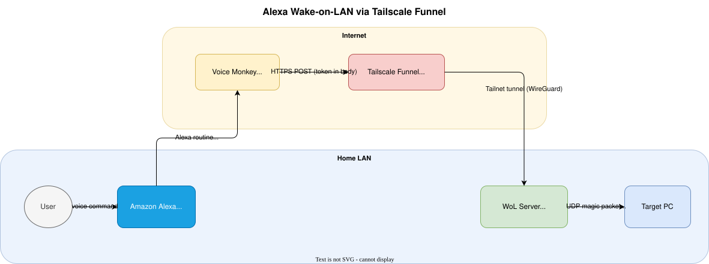

# Alexa Wake-on-LAN via Tailscale Funnel

A self-hosted replacement for the discontinued Amazon Alexa Wake-on-LAN skill. Say *"Alexa, turn on my PC"* and a magic packet wakes your machine — no public IP, no port forwarding, no subscription required.

## How it works



1. You issue a voice command to Alexa to trigger a routine.
2. The [Voice Monkey](https://voicemonkey.io/docs#introduction) Alexa skill triggers a user-defined HTTP request with a secret token in the JSON body.
3. [Tailscale Funnel](https://tailscale.com/docs/concepts/what-is-tailscale) exposes the server to the internet over HTTPS — no public IP or router configuration needed. See also [this intro video](https://www.youtube.com/watch?v=sPdvyR7bLqI).
4. The WoL server validates the token and sends a UDP magic packet on the LAN.
5. Your PC wakes up.

### Everything is free

- **Voice Monkey** — free tier is sufficient (up to 3 flows / routines).
- **Tailscale** — free for personal use; Funnel is included.
- **This server** — runs in Docker on any small always-on box (Raspberry Pi, Orange Pi, NAS, etc.).

## Project structure

```
compose.yaml          # Docker Compose — Tailscale + WoL server
.env_template         # Copy to .env and fill in your values
server/
  app.py              # Python HTTP server (stdlib only)
  Dockerfile          # Production image
  test_app.py         # Unit + integration tests
  test_wol.py         # Manual magic-packet smoke test
.devcontainer/        # VS Code dev container for local development
.vscode/launch.json   # Debug / test launch configurations
```

## Security design

The server is intentionally hostile to unauthorized traffic:

- Only `POST` requests are processed; all other methods silently drop the connection (no response).
- Requests with a wrong or missing token, invalid JSON, or oversized body are silently dropped — no error response is sent to the caller.
- A per-connection inactivity timeout (`WOL_CONN_TIMEOUT`) limits slow-read / Slowloris attacks.
- `WOL_TOKEN` must be at least 16 characters; the server refuses to start with a weak secret.
- The container runs as a non-root user.

A user can optionally place the server on an isolated VLAN and relay only WoL broadcasts between VLANs to further isolate the publicly exposed device. This setup is non-trivial and may not work with every router (tested with MikroTik).

## Setup

### 1. Prerequisites

- [Docker + Docker Compose](https://get.docker.com/) on the host machine (the one that will send magic packets).
- A Tailscale account — sign up free at [tailscale.com](https://tailscale.com).
- A Voice Monkey account — sign up free at [voicemonkey.io](https://voicemonkey.io).

### 2. Configure environment

```bash
cp .env_template .env
```

Edit `.env` and fill in all values. Key settings:

| Variable | Description |
|---|---|
| `TS_AUTHKEY` | Tailscale auth key (`tskey-auth-…`) — generate in the Tailscale admin console |
| `TS_HOSTNAME` | Tailscale node name (e.g. `wol`) — determines your public URL |
| `WOL_TOKEN` | Long random secret shared with Voice Monkey — generate with `openssl rand -hex 32` |
| `WOL_MAC` | MAC address of the machine to wake (colon or dash separated) |
| `WOL_BROADCAST` | LAN broadcast address, e.g. `192.168.1.255` |
| `MACVLAN_PARENT` | Host network interface (`eth0`, `enp3s0`, …) |
| `LAN_SUBNET` | Your LAN in CIDR notation, e.g. `192.168.0.0/24` |
| `LAN_GATEWAY` | Your LAN default gateway, e.g. `192.168.0.1` |
| `CONTAINER_IP` | Static IP for the container — must be unused and outside DHCP range |

Finding network values:
```bash
ip -br addr show          # interface name and IP/subnet
ip route | grep default   # gateway and interface
```

### 3. Enable WoL on the target machine

Make sure Wake-on-LAN is enabled in the BIOS/UEFI of the machine you want to wake and that the network adapter supports it (most wired adapters do). Either use `test_wol.py` from this repo or some other verified WoL tool to confirm that magic packets can wake your machine before proceeding.

Note that WoL packets must be sent from the same broadcast domain (L2 subnet) as the target machine. If your server is on a different VLAN, you are in WSL, inside Docker (e.g. the dev container), or otherwise behind NAT, magic packets will not reach the target machine. The production container in this repo uses `macvlan` to get its own LAN IP and be on the same L2 subnet, so it can send WoL packets successfully.

### 4. Start the stack

```bash
docker compose up -d
```

The Tailscale container will authenticate and bring up Funnel automatically. Your server will be reachable at `https://<TS_HOSTNAME>.<tailnet>.ts.net/`. Check with `docker compose logs -f ts-wol` for Tailscale logs and `docker compose logs -f wol` for server logs.

#### Networking note: macvlan and promiscuous mode

The stack uses a `macvlan` Docker network so the container gets its own LAN IP, which is required for broadcasting magic packets. On some systems (notably **Orange Pi / DietPi** with the `rk_gmac-dwmac` Ethernet driver) the physical NIC does not automatically accept frames addressed to the container's virtual MAC, causing ARP to fail silently and the container to lose connectivity.

**Quick fix:**
```bash
sudo ip link set eth0 promisc on
```

**Persistent fix** (survives reboots) — create `eth0-promisc.service`:

```bash
sudo tee /etc/systemd/system/eth0-promisc.service <<'EOF'
[Unit]
Description=Enable promiscuous mode on eth0 for macvlan
After=network.target
Before=docker.service

[Service]
Type=oneshot
ExecStart=/sbin/ip link set eth0 promisc on
RemainAfterExit=yes

[Install]
WantedBy=multi-user.target
EOF
```

The service waits for the network to be up but runs before Docker, ensuring promiscuous mode is enabled before the container starts. Enable the service and check:

```bash
sudo systemctl enable eth0-promisc.service && sudo systemctl start eth0-promisc.service && ip link show eth0 | grep -o PROMISC
```

#### Test the server

Before proceeding to Voice Monkey, use a [simple tool that can send a POST request](https://reqbin.com/post-online) to verify that:

- your server DNS got registered by Tailscale (takes some time)
- your Tailscale Funnel is set up correctly (check ACLs)
- the web request from the internet actually reaches the server (consider using `WOL_DEBUG=1`)  

### 5. Configure Voice Monkey

1. Create a new monkey in the Voice Monkey dashboard. Follow [Voice Monkey instructions](https://voicemonkey.io/docs#getting-started).
2. Add a new Flow with a `Web Request` Action.
3. Select POST, fill your Tailscale domain `https://<TS_HOSTNAME>.<tailnet>.ts.net/`, paste your JSON body `{"token":"<some_token>"}`.
4. Trigger the Flow manually and check the Docker logs.

## Development

### Dev container

Open the project in VS Code and choose **Reopen in Container**. The dev container uses the same `Python 3.12-slim` base as production and includes:

- git
- `debugpy` for the VS Code debugger
- Python, autopep8, and debugpy extensions pre-installed

### Running the server locally

1. Copy and fill in `.env` (as described above).
2. Use the **Run app.py** launch configuration in VS Code, or from the terminal.

> **Note:** When running inside a dev container you are behind NAT, so the server cannot reach the LAN broadcast address. The server will start and accept requests, but magic packets will not reach real machines on your LAN.

### Running the tests

```bash
cd server && python -m unittest test_app -v
```

Or use the **Run tests (test_app.py)** launch configuration in VS Code. Tests spin up a real in-process HTTP server and cover valid/invalid tokens, all silent-drop scenarios, magic-packet construction, and timeout handling.

### Smoke-testing magic packet delivery

To verify a real magic packet actually reaches your target machine, run this **from the host** (not from the dev container):

```bash
export $(grep -v '^#' .env | xargs) && python3 server/test_wol.py
```

The script must run on a machine with direct L2 LAN access.

## Logs

```bash
docker compose logs -f wol      # WoL server logs
docker compose logs -f ts-wol   # Tailscale / Funnel logs
```

Set `WOL_DEBUG=1` in `.env` (and restart) to log every incoming request including dropped ones — useful for tracing Voice Monkey webhook delivery.
